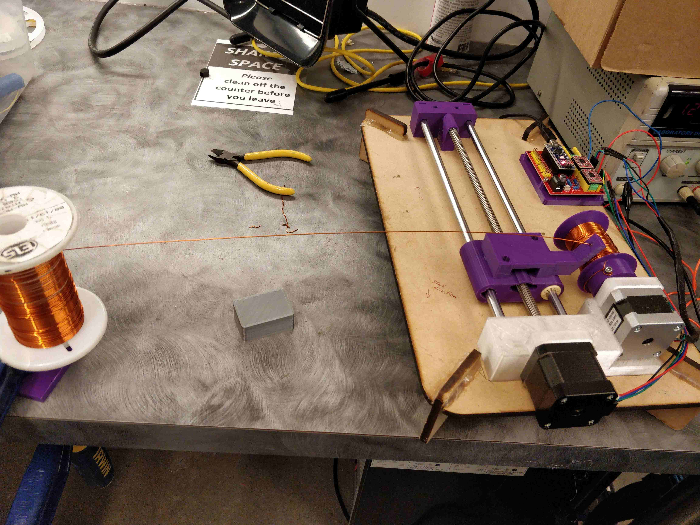
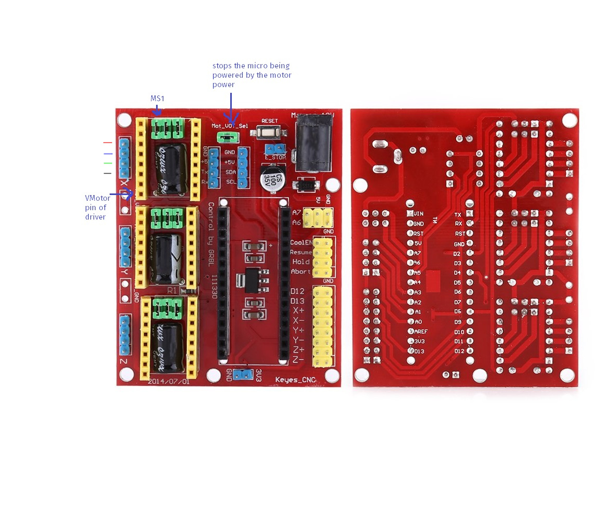

# Solenoid Winder

This is a project to produce a solenoid winding machine to wind the solenoids
for UBC ThunderBots. It uses a design inspired by a 3D printer z-axis to
guide the wire onto a rotating solenoid body.

We use a control board designed for a laser cutter or other small CNC machine
to drive the steppers. The particular one used is the
["Akozon 3D Printer Engraving Expansion Board Kit Controller CNC Shield V4"](https://www.amazon.ca/gp/product/B07DS2T64W/)
with the Arduino Nano clone that comes with it. It should be noted that this
board contains a bug: the microstepping jumpers are configured to pull down
the configuration pins on the drivers (which have internal pull-downs),
meaning that there is no way to set the MS1, MS2 or MS3 pins to high. Due to
this bug, the drivers are forced to full steps. We may hack the stepper
driver boards so they have a bodge wire to directly pull these pins up and
cut the pins going to the buggy mainboard.

The winder is controlled by serial commands. I suggest
[CompuPhase Termite](https://www.compuphase.com/software_termite.htm) on
Windows to control the winder.

### Setup

The solenoid winder board must be connected to a 12v source. We usually use
one of the ThunderBots lab power supplies, set to a current of 1.5A. This
*only* powers the stepper motors, meaning that you can use the serial command
line interface without the external power on.

Due to the habit of the rotational stepper motor to heat up uncomfortably
quickly when it is left on, it is advised to turn off the power supply while
not actively winding. It is a possible future project to replace this stepper
with one that doesn't do that.

Attach the core to the rotational hub with M3 socket head cap screws (keep
these in the hub while not in use!). Feed the wire through the arm on the
carriage, then through one of the four holes in the solenoid core to retain
the end. These are slightly tricky to get the wire through: curve it slightly
to help it along.

Set up the spool holder at least 30cm away from the winder while in use in
order to avoid any possible inconsistencies caused by winding of the source
spool. I usually use a big bar clamp to stick it to the table.

If the winder is doing something bad, you can stop it by pressing the reset
button on the blue microcontroller board, or by turning off the motor power
supply. Either of these actions will safely bring the winder to a halt.



### Operation

Set up your spool width with `spool_width {width in mm}`. Note that you
should set this about 5mm shorter than the actual spool width to avoid
overshooting the end of the spool.

Set the wire width: `wire_width {width in mm}`. This should have a
fudge-factor on it (oversize by ~5%) to ensure that the wire does not
inadvertently wind backwards: the current design of having an arm fairly
close to the spool means that if the winder does start winding in a backwards
direction, it can get back on track, but it is likely a better idea to simply
wind with a tiny bit of extra room.

Then, you can move the carriage either by slowly rotating the lead screw by
hand with the power off or by using `move_lateral {distance_in_mm}`. Note
that the positive direction is marked on the base of the winder and is
oriented away from the stepper on the lead screw.

Once you have the spool width and the wire width set up, you can start
winding by running `go {n_passes}`.

The winder will wind initially in the positive direction as marked on the
board (away from the rotational motor).

Note that each winding back and forth is
counted as two passes. See the diagram below:

```
║     ║        ║     ║
║     ║        ║_____║
╠═════╣ ---->  ╠═════╣
║    ↑║ 1 pass ║‾‾‾‾‾║
║    |║        ║↑    ║
    arm        arm
```

Also, the direction is reversed after every pass but is retained between runs
of the `go` command. This means that if you have already wound some turns and
want to wind some more, you can safely type `go 1` for example, and put on
another layer. If you want to start from the beginning, type `reset`.

Some tension is required on the wire in order to get it to go on straight.
This can be achieved by putting one's finger on the spool or with something
more advanced. Also, the winder itself is not really possible to clamp to the
table and wants to slide around.

## Development

This project is developed using [PlatformIO](https://platformio.org/).

To build from the command line: `platformio run`

To upload from the command line (note that you need to disconnect your
Termite window before uploading or it will fail to upload):
`platformio run -t upload`.

## Board documentation



## Future improvements

- Replace the rotational stepper motor with one that doesn't heat up quite as
  much
- Change the feet to something more flat and sturdy so it is possible to
  clamp the winder to the table
- Put proper connectors on the power input and stepper motors
- Tailstock?
- Hack the stepper driver boards by installing bodge wires and cutting the
  CFG pins on the headers so we get microstepping (currently it does full
  stepping because of a bug in the control board where the configuration pins
  should have a pull-up on the other side of the jumpers but actually have a
  pull-down)